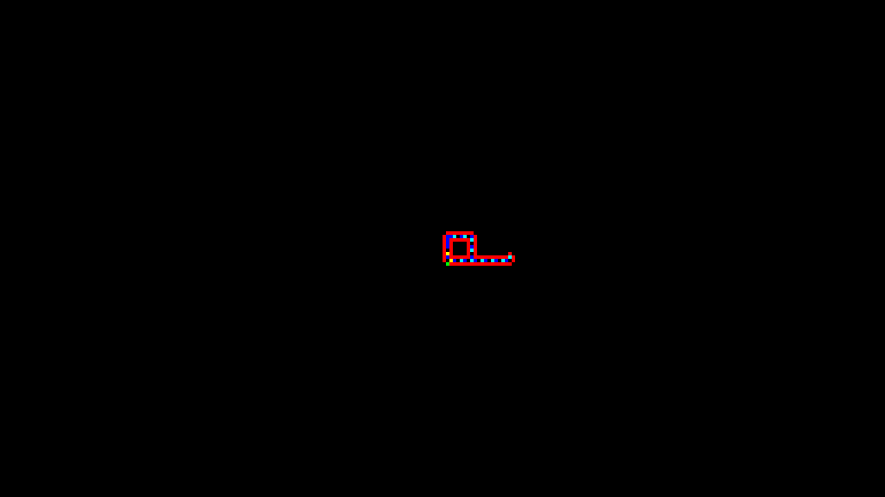
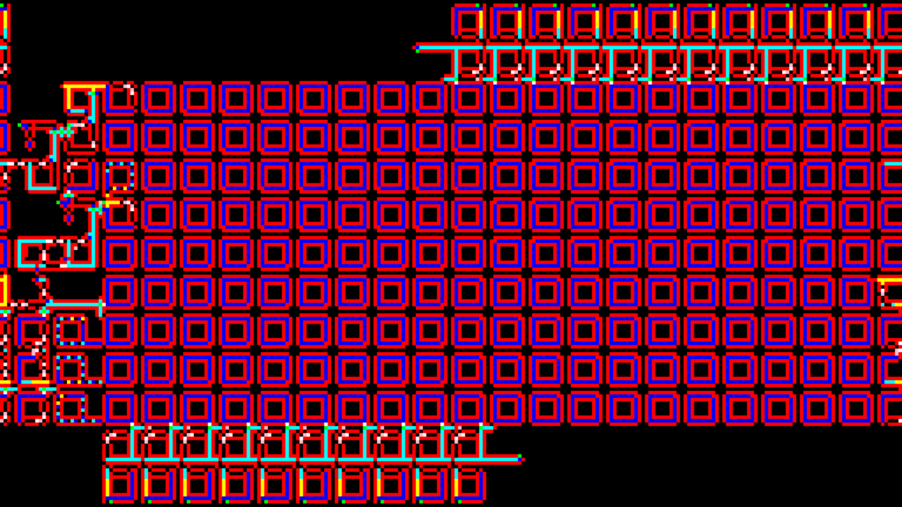

# Langton's Loop Simulation

A simple implementation of **Langton's Loops**, a self-replicating cellular automaton created by Christopher Langton in 1984.

Built using only **HTML, CSS, and JavaScript**.

Langton's Loops are a form of artificial life where loops of cells reproduce by transferring genetic-like information through extending arms, eventually forming new loops and complex colony structures.

---

# ✨ Features

- Pure HTML, CSS, and JavaScript
- Cellular automata simulation
- Self-replicating loop structures
- Multi-state cell system
- Real-time canvas rendering
- Rule-based evolution system
- Lightweight and dependency-free

---

# 🧠 About Langton's Loops

Langton's Loops are a particular type of artificial life simulation based on cellular automata.

Each loop contains encoded instructions that flow through the structure and guide the creation of new loops. As loops reproduce, colonies begin to form naturally over time.

The system uses:

- 8 cell states
- von Neumann neighborhood
- Rotationally symmetric transition rules

As the simulation progresses, reproduction becomes limited by surrounding structures, creating dense coral-like growth patterns.

---

# 🧠 Technical Overview

The simulation is rendered using the HTML5 Canvas API and powered entirely by vanilla JavaScript.

The implementation includes:

- `requestAnimationFrame` animation loop
- Rule-based cellular automata updates
- Double-buffered grid state arrays
- Uint8Array-based cell storage
- Rotational rule expansion
- Dynamic canvas rendering
- Color-coded cell states

The simulation evaluates neighboring cells continuously and updates the grid based on Langton's transition rules.

---

# ⚙️ Simulation Details

The automaton uses:

- 8 possible cell states
- von Neumann neighborhood system
- Rotational symmetry rule expansion
- Continuous generation updates
- Grid-based reproduction mechanics

The initial seed pattern grows and reproduces autonomously over time.

---

# 🌐 Live Demo

```txt
https://langtons-loop-fm0l0rzcc-herry-projects.vercel.app/
```

---

# 📸 Preview





---

# 📁 Project Structure

```bash
Langtons-Loop-Simulation/
│
├── index.html
├── README.md
│
└── Resources/
    ├── img0.png
    └── img1.png
```

---

# 🚀 Run Locally

## Option 1 — Open Directly

Open `index.html` in your browser.

---

## Option 2 — VS Code Live Server

1. Install the **Live Server** extension
2. Right-click `index.html`
3. Click **Open with Live Server**

---

# 🛠️ Built With

- HTML5
- CSS3
- Vanilla JavaScript
- HTML5 Canvas API

---

# 💡 Inspiration

Inspired by:

- Christopher Langton's original Langton's Loop cellular automata
- Artificial life and emergent systems research
- Self-replicating cellular automata experiments

---

# 👨‍💻 Author

### Herry Patel

---
