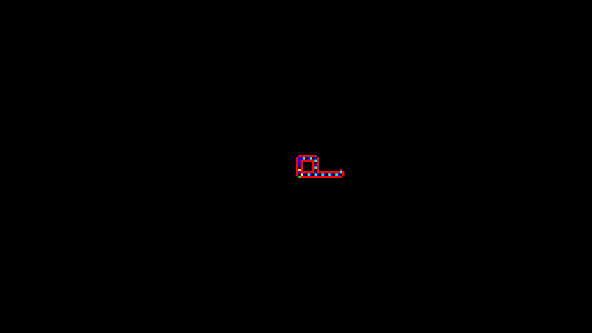

# Langtons Loop Simulation

A Langton's Loop Simulation

using only HTML , CSS and JavaScript

Langton's loops are a particular "species" of artificial life in a cellular automaton created in 1984 by Christopher Langton. They consist of a loop of cells containing genetic information, which flows continuously around the loop and out along an "arm" (or pseudopod), which will become the daughter loop. The "genes" instruct it to make three left turns, completing the loop, which then disconnects from its parent.

Because of a particular property of the loops' "pseudopodia", they are unable to reproduce into the space occupied by another loop. Thus, once a loop is surrounded, it is incapable of reproducing, resulting in a coral-like colony with a thin layer of reproducing organisms surrounding a core of inactive "dead" organisms.

Langton's Loops run in a CA that has 8 states, and uses the von Neumann neighborhood with rotational symmetry.

